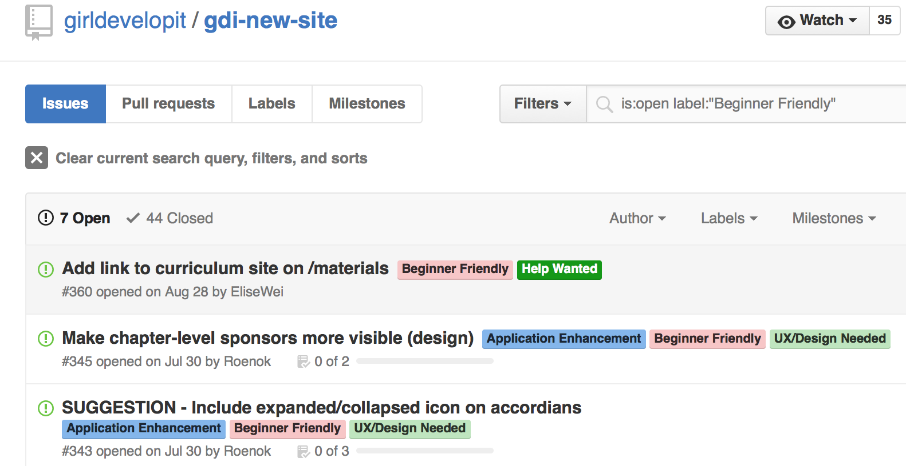
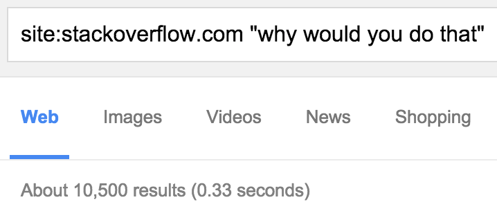
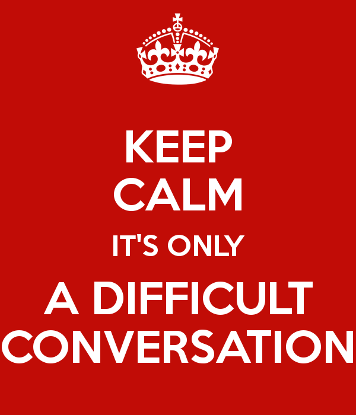

# Welcoming People (and other hard problems)

<!-- START doctoc generated TOC please keep comment here to allow auto update -->
<!-- DON'T EDIT THIS SECTION, INSTEAD RE-RUN doctoc TO UPDATE -->

- [Abstract](#abstract)
- [Welcome, humans!](#welcome-humans)
- [Why diversity?](#why-diversity)
  - [As professionals](#as-professionals)
    - [Examples](#examples)
  - [As humans](#as-humans)
- [On feedback](#on-feedback)
  - [Implicit feedback](#implicit-feedback)
  - [Unintentional feedback](#unintentional-feedback)
  - [My work and myself](#my-work-and-myself)
  - [Pixar’s “Plussing”](#pixar%E2%80%99s-%E2%80%9Cplussing%E2%80%9D)
  - [Good Feedback](#good-feedback)
    - [Every person knows something you don’t](#every-person-knows-something-you-don%E2%80%99t)
- [Onboarding to your Open Source Project](#onboarding-to-your-open-source-project)
  - [Informative website or README](#informative-website-or-readme)
  - [Use labeled issues](#use-labeled-issues)
  - ["How can I help you?"](#how-can-i-help-you)
  - [Do fast first code reviews](#do-fast-first-code-reviews)
  - [During code reviews](#during-code-reviews)
    - [Measuring Engagement at Mozilla](#measuring-engagement-at-mozilla)
  - [Flooding issue tracker? Don't worry!](#flooding-issue-tracker-dont-worry)
- [Microagressions](#microagressions)
  - [Check your speech](#check-your-speech)
  - [Death by a thousand paper cuts](#death-by-a-thousand-paper-cuts)
  - ["The elixir guy"](#the-elixir-guy)
  - [No subtle-isms](#no-subtle-isms)
  - [Talk about this in opt-in channels](#talk-about-this-in-opt-in-channels)
  - [If you are called out](#if-you-are-called-out)
- [Patience with our brains](#patience-with-our-brains)
  - [Fairness Bias](#fairness-bias)
  - [Loss Aversion](#loss-aversion)
  - [Online Negative Bias](#online-negative-bias)
  - [Pygmalion effect / Chameleon effect / Unintentional mirroring](#pygmalion-effect--chameleon-effect--unintentional-mirroring)
- [Welcoming behavior - Higher level](#welcoming-behavior---higher-level)
  - [Common knowledge](#common-knowledge)
    - [Soviet handing leaflets example](#soviet-handing-leaflets-example)
    - ["Naked emperor" example](#naked-emperor-example)
  - [Consequences](#consequences)
  - ["Unwelcoming behavior is not ok", and that is common knowledge](#unwelcoming-behavior-is-not-ok-and-that-is-common-knowledge)
- [Resources](#resources)

<!-- END doctoc generated TOC please keep comment here to allow auto update -->

# Abstract

We interact with people in chat rooms, issue trackers, pull requests, discussion
boards, meetups, hallways, or conferences.

How do we provide feedback constructively?
Are we perceived as friendly as we think we are?
How exactly do our cognitive biases unconsciously affect our interactions?
How do we become conscious of them, and workaround them?
What assumptions does our language carry?

Effective communication is particularly critical for project owners. As leaders,
we open the doors to our gardens, and the first interactions define the tone for
the group, shaping today’s atmosphere as much as tomorrow’s. In this talk, we’ll
explore how to communicate effectively. Always, and with everyone.

# Welcome, humans!

> The major problems of our work are not so much technological as sociological
> in nature
>
> Peopleware: Productive Projects and Teams (1987) - Tom DeMarco and Timothy Lister

> We are **humans** working with **humans** to develop software for the benefit
> of **humans**
>
> http://humanedevelopment.org/

# Why diversity?

## As professionals

Diversity is a learning opportunity. It makes us more capable of delivering a
better product.

> It’s not about adding diversity for the sake of diversity, it’s about
> subtracting homogeneity for the sake of realism.
>
> https://twitter.com/MaryRobinette/status/545428674812465152

### Examples

* Apple Store had a glass stair case. If there had been women in the design
    phases, they would have avoided the skirts problem.
    http://jezebel.com/5810219/courthouses-glass-staircase-clearly-not-designed-with-ladies-skirts-in-mind
* Crash dummies for cars were male until 2011; women and kids weren't taken at
    first into account, and airbags would be hazardous to them.
    http://www.autoblog.com/2012/08/29/theres-a-reason-all-crash-test-dummies-were-male-until-last-yea/
* Heart rate monitor in Apple Watch more innacurate for people with wrist tattoos
    http://www.macrumors.com/2015/04/29/apple-watch-sensors-tattoogate/

## As humans

> When someone has been discriminated against or is a minority, the status quo
> is in and on itself unfair. You need to lift people up, give them
> opportunities that you would not normally. If you are picking names out of a
> hat that's not sufficient because they are in the minority, they have less
> chance to be picked out of the hat. And so it does require you to change your
> mindset, and make an effort to reach out to people who are in a minority
> status in the group, and make sure they are included.
>
> Chad Pytel, developer and CEO of thoughtbot
> http://betweenpipes.com/2015/06/25/Pytel-Fernandez/

# On feedback

## Implicit feedback

Feedback is about all the interactions you have:

* what is NOT said
* who is ignored
* who speaks up
* who stays quiet
* who is invited
* tone of the message
* when in person, body language

## Unintentional feedback

Are we unintentionally telling people that they don’t belong?
The project's name, tone in mailing lists, cultural references, has an impact.

## My work and myself

Creative people often can feel that a rejection of their idea is a rejection of
them.

New legacy code project. Do we criticize the code, the authors, or the system?

> Let's not laugh at this code, and instead understand what we do not
> like about it and how to prevent it from happening in the future.

Work is a consequence of a negotiation of different restrictions, and feedback
should take that into account.

## Pixar’s “Plussing”

> Rather than randomly critique a sketch or shoot down an idea, the general rule
> is that you may only criticize an idea if you also add a constructive
> suggestion. Hence the name plussing. Criticism meetings can be brutal, and
> this is where ‘plussing’ has played a game-changing role at Pixar.
>
> http://www.thinklikeaninnovator.com/plussing-how-pixar-transforms-critiquing-into-creating/

This practice has been built on the core principles from
improvisation, which are:

* accept all ideas / don’t reject any idea
* don't use “that will not work...”
* don't use “yes, but...”
* use “yes, and...”
* make your partner look good
* have you considered...?
* ...what do you think of doing X instead?

http://99u.com/articles/7224/why-fighting-for-our-ideas-makes-them-better

Once that new behavior is recognized as a required behavior, it can then evolve
into a standard practice in the organization. But it must be required and
practiced, first and foremost, by the leaders of the organization.

## Good Feedback

Actionable, specific, and kind.

Not "You always do that thing that's bad for the group", instead "When X happened you did Y, do you think Z would have been better?".

Encouraging, and within recipients scope of skills.

### Every person knows something you don’t

Keeping this in mind will help you treat everyone with care, making them feel
that they have a valuable impact to your project and community.

# Onboarding to your Open Source Project

## Informative website or README

“Landing page” for your projects. Should contain at least:

* Communication channels
* Installation instructions
* Usage examples
* Contributing guidelines

## Use labeled issues

## "How can I help you?"

> Consider changing name from “core team to “support team” to make the project
> more approachable for contributing to it -@OssAnna16
>
> https://twitter.com/cczona/status/640963179099484160

## Do fast first code reviews

> You need to quickly thank and give useful feedback to people who are already
> contributing, even if that feedback will include criticism.
>
> How To Improve Bus Factor In Your Open Source Project - Sumana Harihareswara
> http://www.harihareswara.net/sumana/2015/8/9/0

## During code reviews

* Try to respond to every question and comment
* If you disagree strongly, consider giving it a moment before responding
* Don’t assume people share your experience or context. Avoid words like
    “basically”, “simply”, “clearly”, “obviously”, etc
* Also, feedback. We just talked about feedback

### Measuring Engagement at Mozilla

https://docs.google.com/presentation/d/1hsJLv1ieSqtXBzd5YZusY-mB8e1VJzaeOmh8Q4VeMio/edit#slide=id.g4435d357b_25

Slide 8

> Most significant barrier to engaging in onramping others is unclear
> communications and unfriendly community.

Slide 26

> Contributors who received code reviews within 48 hours on their first bug have
> an exceptionally high rate of returning and contributing.

> Contributors who wait longer than 7 days for code review on their first bug
> have virtually zero percent likelihood of returning.

> Showing a contributor the next bug they can work on dramatically improves the
> odds of contributing.

## Flooding issue tracker? Don't worry!

Fat released Twitter Bootstrap and it was an instant success, and his "puppy"
was suddenly a "dog" that didn't even fit in his appartment, and people were
waiting on issues and pull requests, and anxiety OMG and guilt and everything!

[Fat: What Is Open Source & Why Do I Feel So
Guilty?](https://www.youtube.com/watch?v=UIDb6VBO9os)

Canned responses for everyday interactions is a time saver and increases the
chance we will respond respectfully to everyone. During the day and the week we
don’t keep consistent stamina reserves; but we can keep prepared responses to
common situations so that responses are positive.

Copy & paste a paragraph of text, press a button, and you took good care of an
issue.

Situations we see often enough:

* Issue is not a bug
* Issue is too specific to your app
* Issue is stale and abandoned
* Issue could be a patch. "Go for it!"
* Unclear request
* Recurring question

All of these are detailed on the [Maintaining Open Source Projects (Beta)
book](http://maintaining-open-source.com/).

# Microagressions

Unintentional daily acts that reinforce stereotypes and oppression.

## Check your speech

Change unwelcoming speech defaults

https://twitter.com/alexfulsome/status/641748473470054400

* Hi, guys!
* You are crazy
* You code like a girl

## Death by a thousand paper cuts

Julie Pagano's blog post, "my experiences in tech: death by 1000 paper cuts",
describes her old job in one single paragraph that might leave you out of
breath. I quote it because it illustrates many common examples. We can learn
from good examples, and from the following ones too:

* Someone in authority pats me on the head to dismiss an argument as though I
    was a child – a thing he’d be unlikely to do with a male coworker
* Same person makes comments when I wear makeup to work – I feel uncomfortable
    doing so again
* I’m asked to take notes in meetings where I am a technical lead and should be
    actively participating
* Male coworkers make comments about stalking women on facebook and looking at
    images of booth babes in work meetings (some later apologize)
* Others say that front-end development isn’t real software engineering
* I suspect I’m paid less than male colleagues (perhaps paranoia, perhaps real)

http://juliepagano.tumblr.com/post/46206589124/my-experiences-in-tech-death-by-1000-paper-cuts

The problem with microagressions is they are hard to spot for the people
commiting them, but they have very real impact. Julie found another
job to be more comfortable at work.

## "The elixir guy"

Lennart Fridén went to an erlang meetup and he was tagged the elixir guy. He
says people with no thick skin might never come back, because they can feel
intimidated. Feelings matter, and what and how we communicate is intrinsically
related with feelings we convey and evoke.

http://codecoupled.org/2015/06/20/syntax-semantics-and-aesthetics/

## No subtle-isms

"No subtle-isms" is about recognizing the ways we’re unconsciously making our
friends’ lives a little worse. Commiting subtle-isms does not make you a bad
person and is not a huge deal, but it's good to keep in mind to avoid it in the
future.

https://www.recurse.com/blog/38-subtle-isms-at-hacker-school

## Talk about this in opt-in channels

Instead of somewhere that’s opt-out (like the mailing list, public chat, or
within earshot of someone trying to program).

* We want marginalized people to feel welcome, not like they have to defend
    their presence
* We don’t want marginalized people to have to spend time educating
    non-marginalized people who might be coming to these ideas for the first
    time

This gives everyone an equal chance to focus on programming.

## If you are called out

If someone says to you, “hey, you just feigned surprise” or “that’s subtly
sexist”, it doesn’t mean you’re a “bad” person. We’ve all done these things
before. Do the following:

* Don’t worry
* If it's subtle, it’s probably not obvious
* Apologize, reflect for a second
* Move on

# Patience with our brains

Our brain shortcuts make us efficient at saving energy but also make us arrive
at illogical conclusions. We have flaws in our cognition, "low level bugs", and
knowing about them we can adjust our behavior.

A [cognitive bias] is a pattern of deviation in judgment from which inferences
about other people and situations may be drawn in an illogical way.

We'll see a few examples, and their application in our work in the Open Source
community:

[cognitive bias]: https://en.wikipedia.org/wiki/Cognitive_bias

## Fairness Bias

[Fairness bias] describes our tendency to seek balance. If a supplier keeps an
open line of communication with an unhappy customer about a faulty product, the
customer will respond more favorably regardless of the outcome. The need to be
heard takes precedence over the need for the product working correctly.

Fairness bias can be applied to code reviews.

* As contributors: we can harness this effect before the conversation is even
    started, by explaining the rationale behind our work beforehand.
* As reviewers: frame a comment as a question instead of as an assertion to make
    the contributor feel heard and valued.

[Fairness bias]: http://www.amazon.com/Sway-Irresistible-Pull-Irrational-Behavior/dp/0385530609

## Online Negative Bias

Daniel Goleman, psychologist, author and journalist, identifies an [online
negative bias]: the positive message you just wrote may be assumed to be
neutral, and what seemed indifferent to you can be read as hostile by remote
readers. Written discussions have less bandwidth than conversations over the
phone or in person, and need to include more context.

As contributors and as reviewers:

* Use positive language instead of neutral
* Meet in person with your team, or discuss over video or phone whenever
    possible

[online negative bias]: https://www.youtube.com/watch?v=TBCiSAJ20Wc

## Pygmalion effect / Chameleon effect / Unintentional mirroring

The Pygmalion Effect was [studied in a training
camp](http://psycnet.apa.org/journals/apl/67/2/194/) where officers were about
to instruct a leadership development course for junior officers. A subset of the
junior officers would become the next batch of leaders. The training officers
were informed, based on ratings by previous commanders, which trainees presented
“high”, “regular” or “unknown” command potential. What neither trainers nor
trainees knew was that researchers assigned scores randomly.

Four months later all trainees took a test based on the materials they learned
during the program. Researchers found that trainees whom the training officers
thought had high potential scored better on the test than their “unknown” and
“regular” counterparts. Being *labeled* as leaders resulted in actual improved
exam results.

“The Cathedral and the Bazaar” is a famous essay by Eric Raymond on software
engineering states in its 10th lesson:

> Treat all your contributors as if they are the most valuable resource, and
> they will respond by becoming your most valuable resource.

Raymond’s lesson illustrates the “[Chameleon Effect]”: the human tendency to
take on characteristics that have been arbitrarily assigned to us.

[Chameleon Effect]: https://en.wikipedia.org/wiki/Pygmalion_effect

# Welcoming behavior - Higher level

I recently pitched my talk to an older woman I know, and she half-joningly
replied: "in the end we are all hypocrites, we say nice things but we don't
actually mean them". I vocally disagreed, but it made me wonder: How many people
are comfortable with contradictory lifestyle and morals? Is it most? And if it
is most, does it make sense to try to change it, or should we just accept our
flaws? Is our desire to make software communities more welcoming to everyone
kind-hearted idealism, or a goal we can improve on?

**And I remembered slavery**

Slavery was a legal, sizeable business. Powerful organizations depended on it,
and could enforce in court their right to trade humans. If I read the definition
of what was common business you now freak out:

Now slavery is illegal in all countries, and when states violate this principle
the International Labor Organization prosecutes them in the International Court
of Justice. The US Senate has recently passed a resolution apologizing to
African-Americans for the “fundamental injustice, cruelty, brutality, and
inhumanity of slavery”.

Slavery is not over, but it certainly is less frequent, and now it's easier to
fight against. A step forward.

**And I remembered women’s suffrage**

Women's right to vote proponents had to change collective consciousness once. Now many countries have had female presidents for years.

There are still other rights to pursue, but women’s vote is today as significant
as any other person in society. A step forward.

**And I remembered same-sex marriage**

In the US, same-sex marriage went from a “we don’t talk about that” discourse to
federal law in a few years.

**And I remembered salary gaps**

I remembered some real colleagues living real lives earning real salaries,
telling me they would be fine getting a pay cut if that made the organizations
they worked for more fair to everyone and sustainable as a whole.

Implementing open salaries may be a step forward against salary gaps.

They all were (and are) political changes that seemed impossible to discuss
while they were not yet obtained, and afterwards they were broadly embraced by
society, government, and even supranational organizations.

How does that happen? Does the majority of society switch opinions at roughly
the same time?

## Common knowledge

It might not be their opinions that change, but I'll argue that "common
knowledge" of those opinions are what triggers the changes.

There is common knowledge of a fact when in a group:

* everyone knows the fact
* everyone knows that everyone knows the fact
* And so on

### Soviet handing leaflets example

> A soviet stands in the Moscow train station, handing out leaflets to everyone
> who passes by. The KGB arrests this person, but they discover that the
> leaflets are blank pieces of paper, and they demand:
>
> - “What’s the meaning of this?”
> - “What is there to write?” he replies, “It’s obvious!”
>
> The man is trying to make common knowledge something he assumes his “readers”
> already know.
>
> http://www.scottaaronson.com/blog/?p=2410

### "Naked emperor" example

https://en.wikipedia.org/wiki/The_Emperor's_New_Clothes#Plot

## Consequences

Stating something publicly (even when obvious) can change how a group of people
feel and behave.

Even if everyone knows that talking about salary is beneficial, if it’s not
common knowledge, anyone who publishes their salary might incur in personal
risk. In the naked emperor story, it takes an innocent child to change the
awkward silence into open discussion of the they were all seeing.

Until an announcement, it’s possible that not everyone knew that everyone knew
the thing, and that can prevent individuals from acting.

As a dictatorial leader, to prevent something from becoming common knowledge,
all you need to do is censor the common-knowledge-producing mechanisms: the
press, the Internet, public meetings, the #talkpay Twitter thread.

## "Unwelcoming behavior is not ok", and that is common knowledge

We all know many concrete unjust situations in our organizations, and we want to
change them. That is common knowledge at least for Open Source and Feelings
participants (not only in person, but also Twitter, Confreaks, and elsewere).

* Let's carefuly talk about salaries
* Let's carefuly talk about microagressions
* Let's talk about gender and race ratios in our teams

Like slavery moved from a “that's how the world works” into an awkward “I swear
I grant my employees all their rights (I even pay them fairly!)”, let's make
it common knowledge the fact that gender, or race does not affect the value of
our work, the opportunities we get, or the recognition or salary we should get.

We all know that, and we all know that we know that. Armed with this, let's move
forward to more welcoming communities.

# Resources

* http://blog.ellenchisa.com/2015/09/24/gendered-communication-feedback
* http://www.rebeccamiller-webster.com/2015/08/frameworks-feedback/
* http://www.ashedryden.com/blog/codes-of-conduct-101-faq#cocfaqnegative
* https://en.wikipedia.org/wiki/Common_knowledge_%28logic%29#Example
* https://en.wikipedia.org/wiki/Slavery
* https://en.wikipedia.org/wiki/Timeline_of_women’s_rights_%28other_than_voting%29
* https://en.wikipedia.org/wiki/Women’s_suffrage
* Cultivating Empathy - Dajana Günther and Leslie Hawthorn
  http://media.eurucamp.org/eurucamp/2015/DG_Tweety
* Will the Real Technical People Please Stand Up? - Leslie Hawthorn
  http://media.eurucamp.org/eurucamp/2015/lhawthorn
* On the value of controversy for group creativity
  http://onlinelibrary.wiley.com/doi/10.1002/ejsp.210/abstract
